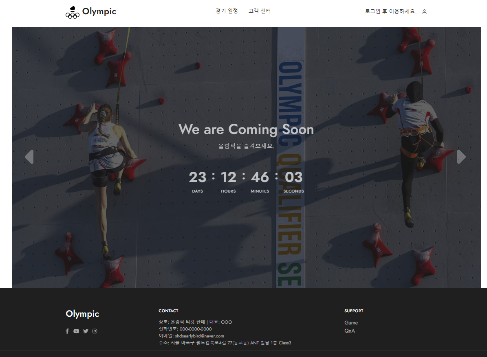
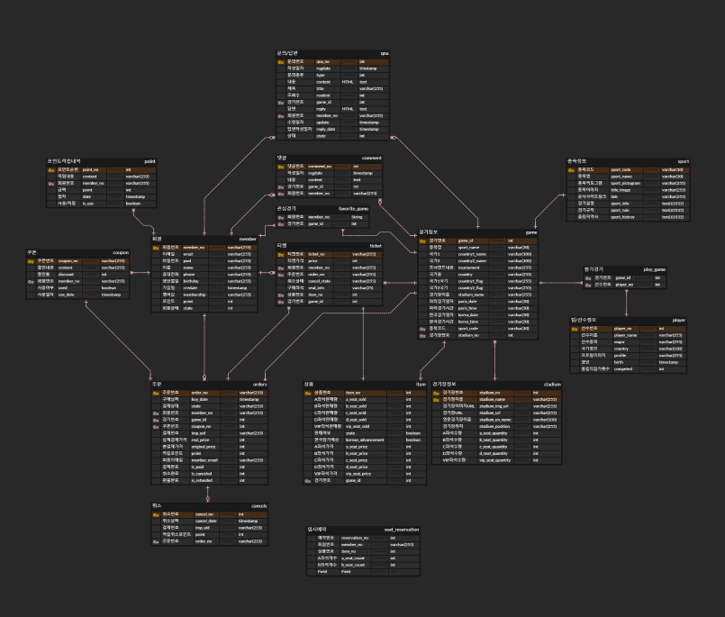
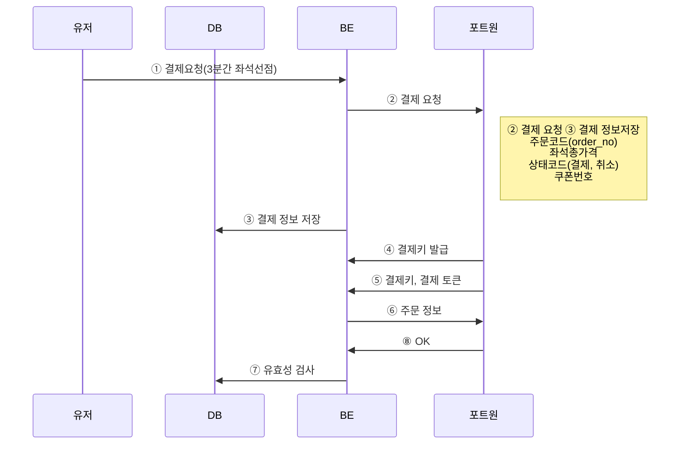
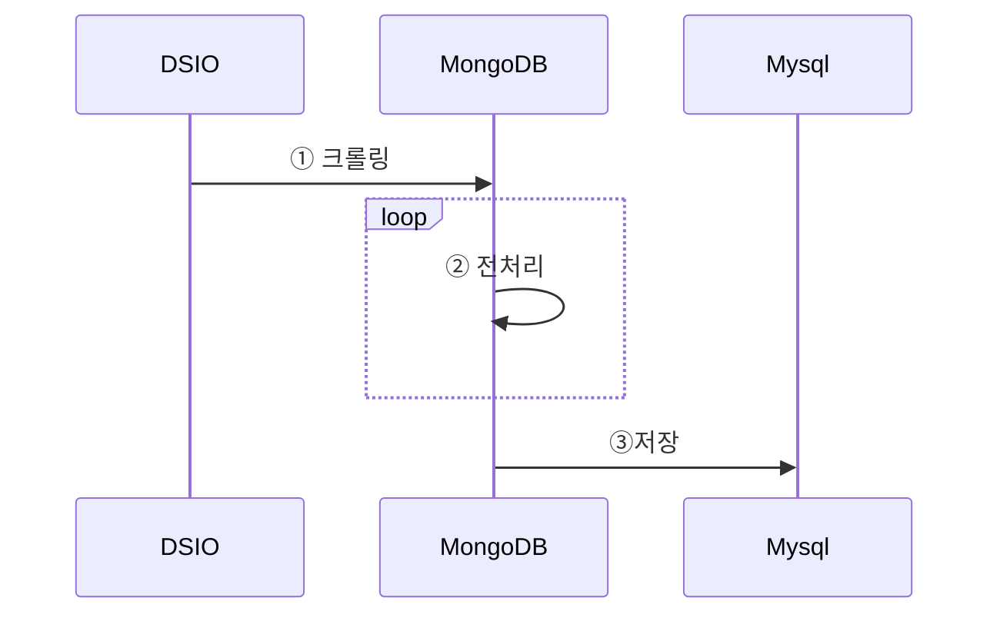

# Olympic_project
              

## 목차  
1. [프로젝트 구조](#1-프로젝트-설명)  
2. [ERD 및 테이블](#2-erd-및-테이블)  
3. [프로젝트 목표](#3-프로젝트-목표)  
4. [결제프로세스](#4-결제프로세스) 

## 1. 프로젝트 설명
프로젝트 주제: 티켓 판매 쇼핑몰 구현

특별한 시즌 티켓 판매 사이트(올림픽, FIFA, E-Sport 등)

실제 파리 올림픽 데이터 이용(경기 일정, 경기장 정보 등)

## 2. ERD 및 테이블

## 3. 프로젝트 목표
- 주문, 취소, 환불, 포인트, 쿠폰 기능 구현
- Ajax를 이용한 SPA 구현
- 데이터파이프라인 구현

## 4. 결제프로세스

## 5. 데이터프로세스
