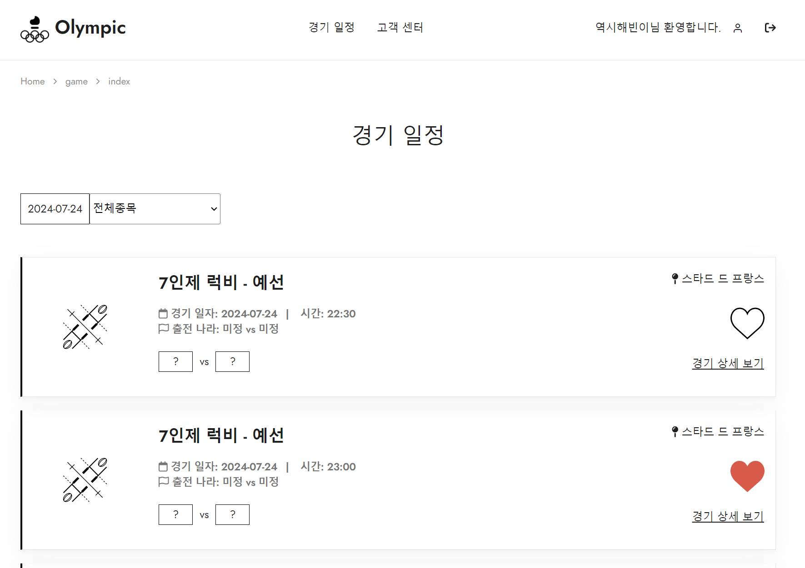
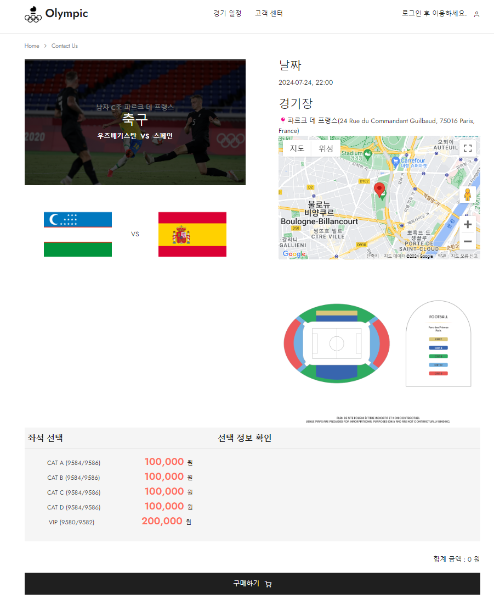
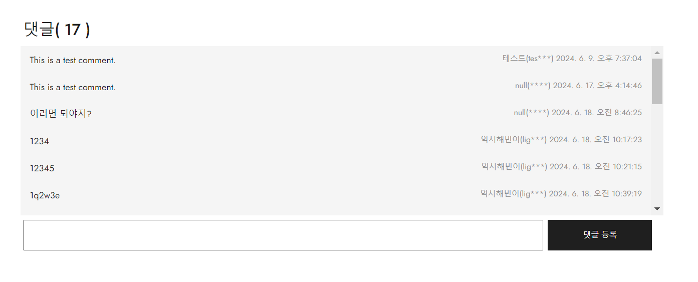
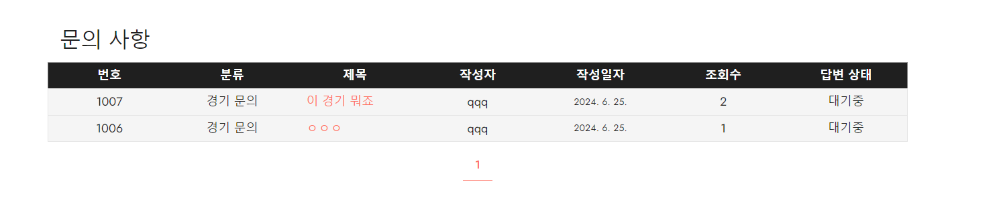
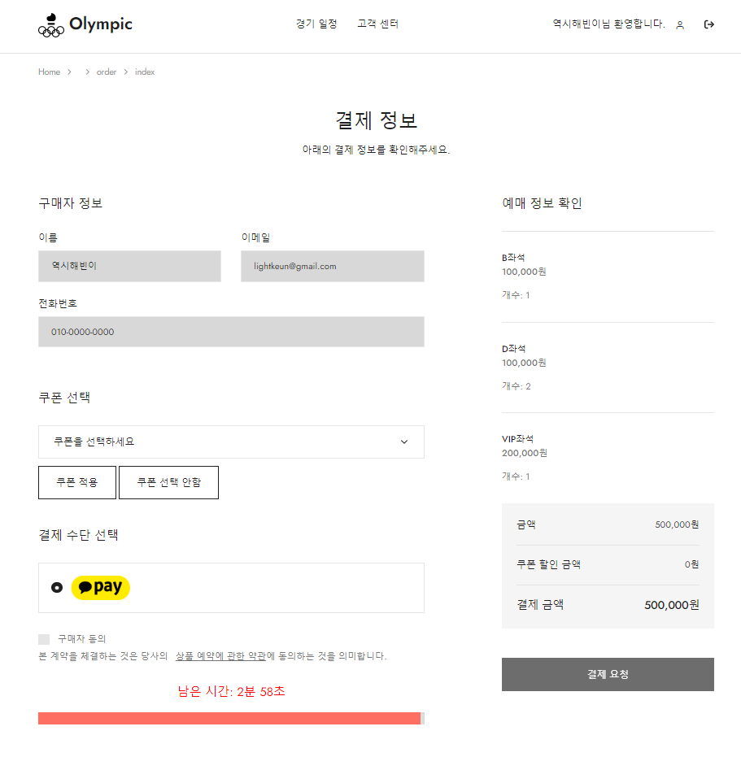
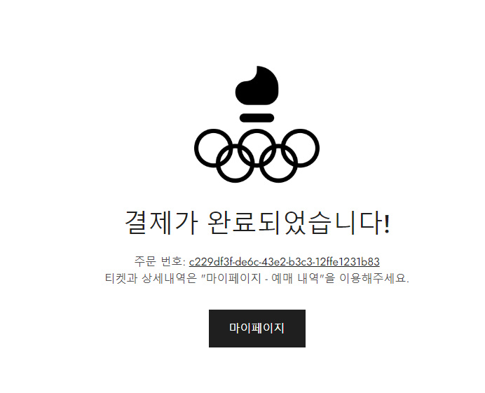
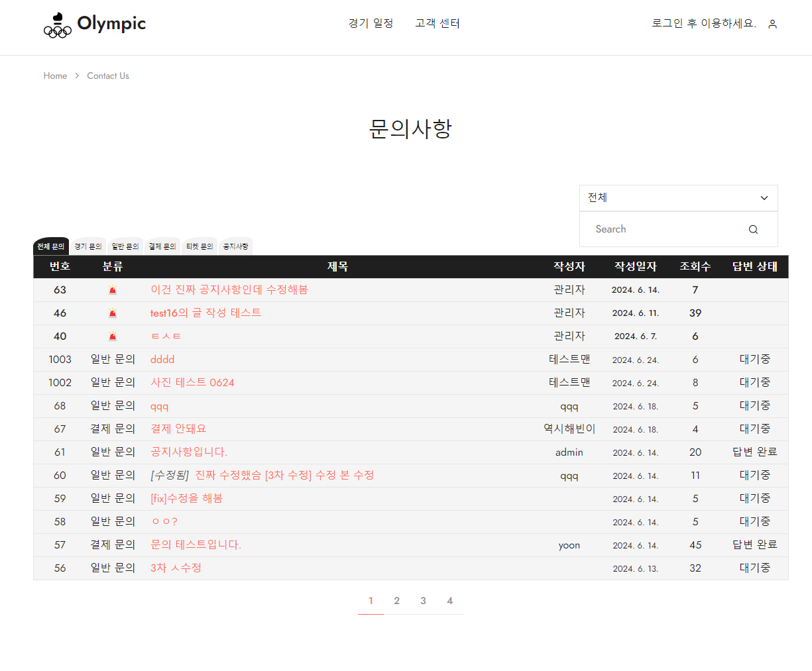
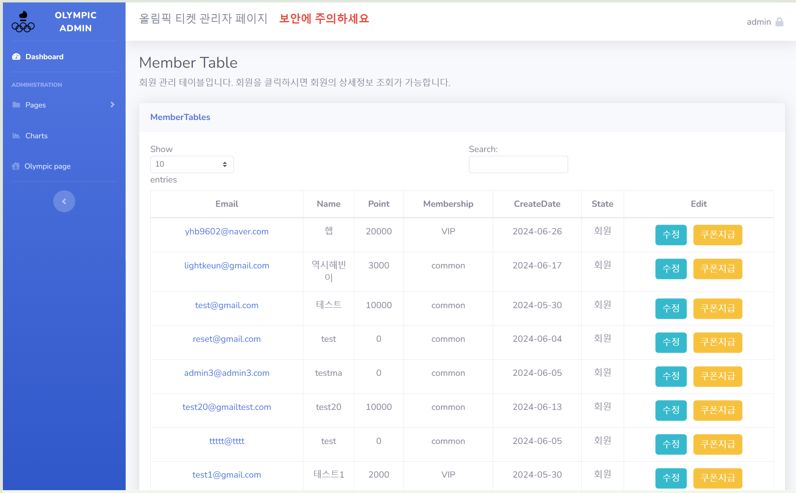

# Olympic_project
              

## 목차  
1. [프로젝트 구조](#1-프로젝트-설명)  
2. [ERD 및 테이블](#2-erd-및-테이블)  
3. [화면구성](#3-화면-구성)
4. [프로젝트 목표](#4-프로젝트-목표)  
5. [결제프로세스](#5-결제프로세스) 

## 1. 프로젝트 설명
프로젝트 주제: 티켓 판매 쇼핑몰 구현

- 특별한 시즌 티켓 판매 사이트(올림픽, FIFA, E-Sport 등)

- 실제 파리 올림픽 데이터 이용(경기 일정, 경기장 정보 등)

## 2. ERD 및 테이블

## 3. 화면 구성

| 메인페이지  |
|--|
|  |

| 경기조회  |
|--|
|  |

| 경기상세1  |
|--|
|  |

| 경기상세2 - 응원 댓글  |
|--|
|  |

| 경기상세3 - 경기 문의  |
|--|
|  |

| 결제기능  |
|--|
|  |

| 결제완료  |
|--|
|  |

| 게시판  |
|--|
|  |

| 관리자페이지1  |
|--|
|  |

| 관리자페이지2  |
|--|
|  |

## 4. 프로젝트 목표
- 쇼핑몰 웹 페이지 구현
    - jQuery, Spring MVC기반 웹개발, SQL
- 결제 서비스 구현
    - 경기 좌석 결제 및 결제 취소, 쿠폰, 포인트 구현
- 올림픽 경기 정보 수집
    - 경기일정, 경기장, 종목 정보 수집
- admin 페이지를 개발하여 관리자 도구 제공
- AWS EC2와 Docker와 Jenkins를 활용한 CI/CD 구축
    - CI/CD 자동화를 통해 무중단 배포 서비스 제공 

## 5. 결제프로세스

## 5. 데이터프로세스
